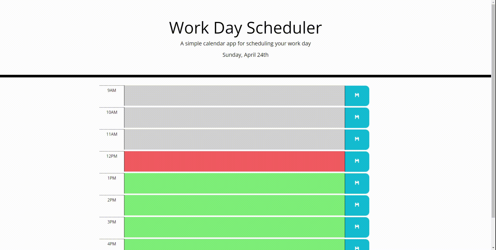

# Work Day Scheduler

Create a calendar application that allows user to save events for each work hour within the current day.

---

## Table of Content

- [Current Day](#current-day)
- [Time Blocks](#time-blocks)
- [Local Storage](#local-storage)
- [Screenshot](#screenshot)
- [Page Link](#page-link)

---

## Current Day

Along the webpage title and description at the top of the webpage, the current day is display using moment.js.

---

## Time Blocks

There is a time blocks for each hour of the standard business hours (9AM - 5PM). Each time block has 3 elements that are the time hour, editable textarea, and a save button. The editable textarea is where the user enter the event into. When click, the save button saves the time block event into local storage.

---

## Local Storage

The save events are store in local storage under the key workDayEvents and indexed by the day and hour. When loading, the webpage will get the events from local storage and display all save events that corresponded to the current day and hour.

---

## Screenshot

---

## Page Link

Link: <a href="https://ptran77.github.io/code-quiz/">https://ptran77.github.io/work-day-scheduler/</a>
